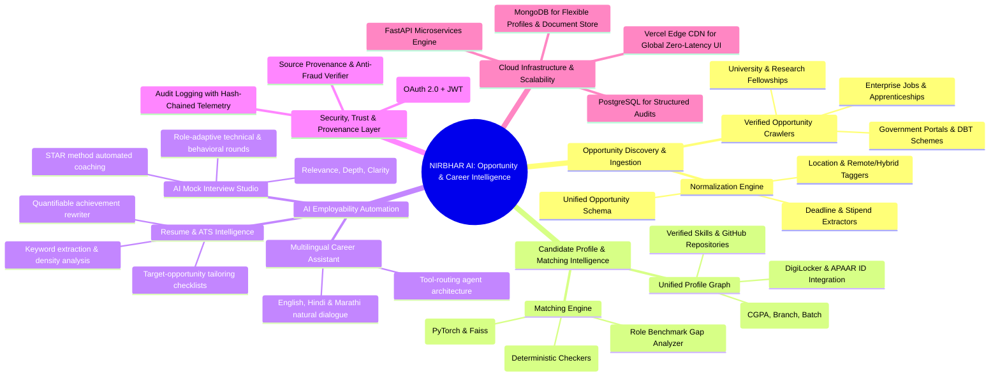

# NIRBHAR AI — Career & Opportunity Intelligence Platform

> **Your AI Guide to Opportunities** — Employability Automation, Real-Time Opportunity Discovery, AI Career Assistant, Resume ATS Analyzer, AI Mock Interview Studio, and Zero-Trust Provenance.

---

## 🧭 Product Vision & Core Mission

**NIRBHAR AI** solves the fragmentation of opportunity discovery and employability for Indian students and early-career professionals. Instead of generic enterprise ERP software, NIRBHAR AI functions as an end-to-end intelligent career companion:

$$\text{Discover} \longrightarrow \text{Understand} \longrightarrow \text{Match} \longrightarrow \text{Check Eligibility} \longrightarrow \text{Learn} \longrightarrow \text{Apply} \longrightarrow \text{Track} \longrightarrow \text{Improve}$$

---

## 🏛️ System Architecture Blueprint

NIRBHAR AI preserves the high-performance components of the original technical stack while pivoting directly to student-to-career intelligence:



---

## 🏢 100-Layer Modular Architecture & Monorepo Structure

The platform is architected for production-grade scale using an enterprise monorepo workspace:

```
nirbhar-ai/
├── apps/
│   ├── web/                     # Public Career Intelligence Portal (Next.js / Static Edge)
│   ├── student-portal/          # Candidate Dashboard, Profile Graph, Applications Tracker
│   ├── admin-console/           # Source verification, fraud review, pipeline analytics
│   └── mobile/                  # React Native mobile client for Android / iOS
├── services/
│   ├── crawler-service/         # Scrapes & normalizes jobs, scholarships & govt schemes
│   ├── matching-engine/         # Fast eligibility computation & FAISS vector search
│   ├── recommendation-service/  # Career pathways & learning roadmap graph generator
│   ├── interview-engine/        # WebRTC audio/video stream analysis & rubric scorer
│   ├── resume-ats-service/      # PDF parser, keyword density & quantifiable bullet enhancer
│   ├── chat-agent-service/      # Multilingual LLM orchestrator (EN / HI / MR)
│   ├── auth-service/            # Zero-trust OAuth 2.0, JWT rotation, DigiLocker KYC
│   └── notification-service/    # WhatsApp, SMS, & Push deadline radar alerts
├── packages/
│   ├── ui/                      # Shared design tokens, buttons, cards, modals
│   ├── schemas/                 # Pydantic & TypeScript schemas for opportunities
│   ├── database/                # Prisma / SQLAlchemy models (PostgreSQL & MongoDB)
│   └── utils/                   # Telemetry, hash verifiers, language parsers
├── assets/
│   ├── nirbhar-ai-architecture.jpg  # Official system architecture blueprint image
│   └── icons/                       # Brand SVG icons & favicon
├── css/
│   └── main.css                 # Unified dark navy & cyan design system
├── js/
│   └── main.js                  # Reactive state, filters, eligibility checker, chatbot
├── vercel.json                  # Vercel zero-build static deployment config
├── package.json                 # Project manifest & metadata
└── README.md                    # Technical documentation & blueprint
```

---

## 🚀 Key Interactive Modules Available in this Build

1. **Flagship 8-Step User Journey:**  
   Interactive roadmap walking candidates from discovery to post-interview improvement.
2. **Real-time Opportunity Discovery Engine:**  
   Reactive filtering by category (Jobs, Internships, Fellowships, Scholarships, Govt Schemes), work mode (Remote/Hybrid/On-site), and sort orders (Highest Match / Soonest Deadline).
3. **Automated Eligibility Modal:**  
   Calculates deterministic PASS/PARTIAL/FAIL criterion breakdown comparing academic criteria, CGPA, graduation batch, and verified skills against candidate profile.
4. **Multilingual AI Career Assistant:**  
   Context-aware conversational agent supporting English, Hindi, and Marathi with instant suggestion chips.
5. **Skills & Learning Roadmap:**  
   Interactive target role alignment recalibration with dynamic milestone checklists.
6. **Resume Intelligence & ATS Recalculator:**  
   Live 88/100 ATS gauge with interactive tailoring checklist that dynamically recalculates candidate placement probability.
7. **AI Mock Interview Studio:**  
   Simulated interview rounds (Tech Round 1, System Design, Behavioral) with real-time rubric meters (Relevance, Technical Depth, Clarity) and constructive feedback.
8. **Application Radar Kanban Board:**  
   4-column tracking board (`Discovered ➔ Preparing ➔ Applied ➔ Interviewing`) with advance-stage buttons and dynamic application counter.
9. **Primary Architecture Blueprint Viewer:**  
   Interactive `` element rendering `assets/nirbhar-ai-architecture.jpg` with interactive Zoom In (`+`), Zoom Out (`-`), Reset, and Fullscreen Lightbox modal.
10. **Security, Trust & Provenance Layer:**  
    Replaces heavy blockchain requirements with lightweight source verification, zero-trust OAuth 2.0/JWT security, and audit provenance.

---

## 🛠️ Local Development & Deployment

### Run Locally
```bash
# Serve static web portal
npx serve .

# Or using Python 3
python -m http.server 3000
```
Open `http://localhost:3000` in your browser.

### Deploy to Vercel
NIRBHAR AI includes a dedicated `vercel.json` configured for root zero-build static serving:
```bash
vercel --prod
```

---

## 📜 Intellectual Property & Attribution
© 2026 NIRBHAR AI. All rights reserved.  
*Empowering India's students and youth through autonomous opportunity intelligence.* 🇮🇳
