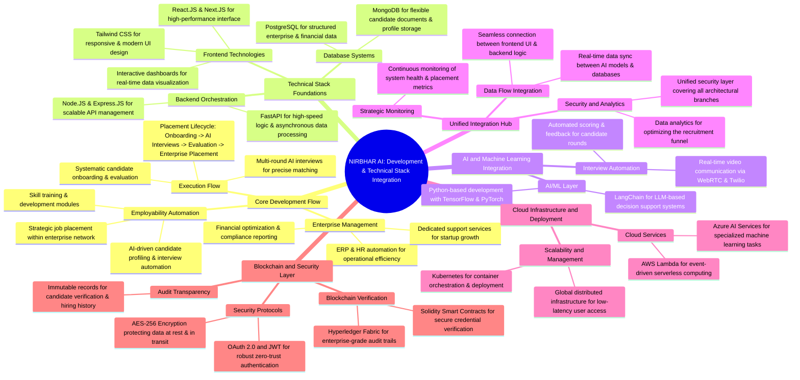

# NIRBHAR AI — Development and Technical Stack Integration

> Autonomous Enterprise Intelligence, Employability Automation, Multi-Round AI Interviews, and Blockchain-Verified Credentials.

---

## Architecture Overview

**Nirbhar AI** is an enterprise-grade AI ecosystem bridging operational ERP management, automated candidate onboarding, multi-round AI interviews, smart contract credential verification, and multi-cloud scalability.



---

## The Six Architectural Pillars

### 1. 🛠️ Core Development Flow
- **Enterprise Management:** ERP and HR workflows automated for maximum operational efficiency, coupled with automated financial compliance reporting and dedicated tools for startup acceleration.
- **Employability Automation:** Automated candidate profiling, personalized skill roadmaps, and direct placement pipeline across partner enterprises.
- **Placement Lifecycle:** 
  $$\text{Onboarding} \longrightarrow \text{AI Interviews} \longrightarrow \text{Evaluation} \longrightarrow \text{Enterprise Placement}$$

### 2. 💻 Technical Stack Foundations
- **Frontend Layer:**
  - **React.js & Next.js:** Server-side rendering (SSR), high-efficiency client-side routing, and responsive web components.
  - **Tailwind CSS:** Modern utility-first styling with dark/light mode system variables.
  - **Interactive Dashboards:** Real-time data visualization for candidate matrices, active streams, and placement KPIs.
- **Backend Orchestration:**
  - **Node.js & Express.js:** Enterprise API gateway, authentication router, and microservices coordinator.
  - **FastAPI (Python):** Asynchronous high-throughput engine for machine learning inference, speech processing, and candidate ranking.
- **Database Architecture:**
  - **PostgreSQL:** ACID-compliant relational storage for enterprise finances, corporate accounts, and structured logs.
  - **MongoDB:** Scalable document database storing dynamic candidate CVs, skill trees, and interview transcripts.

### 3. 🤖 AI & Machine Learning Integration
- **AI/ML Core:** Python-based pipelines running **TensorFlow** and **PyTorch** for deep learning evaluation and predictive talent scoring.
- **Decision Engine:** **LangChain** LLM orchestration driving multi-round conversational questioning and role-tailored rubrics.
- **Interview Automation:** Low-latency peer-to-peer video streaming powered by **WebRTC** and **Twilio**, with real-time sentiment analysis, anti-fraud checks, and automated candidate feedback scoring.

### 4. 🌐 Unified Integration Hub
- **Data Flow Integration:** Real-time bi-directional synchronization between user interfaces, backend controllers, and machine learning models.
- **Security & Funnel Analytics:** Unified perimeter monitoring with deep funnel analytics to optimize candidate transition rates.
- **Strategic Monitoring:** 24/7 telemetry tracking placement metrics, server health, and model latency.

### 5. ☁️ Cloud Infrastructure & Deployment
- **Cloud Services:** Event-driven serverless compute via **AWS Lambda** and specialized computer vision/NLP services via **Azure AI**.
- **Scalability & Containerization:** **Kubernetes (K8s)** automated cluster orchestration with global multi-region edge routing.

### 6. 🔒 Blockchain & Security Layer
- **Zero-Trust Security:** Strict **OAuth 2.0**, cryptographically signed **JWT** tokens, and **AES-256** encryption for data at rest and in transit.
- **Hyperledger Fabric:** Enterprise permissioned ledger capturing immutable audit logs of hiring events, offers, and compliance milestones.
- **Solidity Smart Contracts:** Verifiable on-chain candidate credential tokens ensuring zero fraud and instantaneous recruiter verification.

---

## Project Structure

```
nirbhar-ai/
├── index.html              # Interactive platform & architecture mindmap explorer
├── css/
│   └── main.css            # Complete design system & interactive component styles
├── js/
│   └── main.js             # Interactive mindmap switcher, lifecycle stepper, simulator
├── assets/
│   └── icons/
│       ├── favicon.svg     # SVG favicon
│       └── logo.svg        # Full brand logo
├── vercel.json             # Vercel deployment configuration & security headers
├── .vercelignore          # Vercel deployment exclusions
├── .gitignore              # Git ignore rules (includes .vercel/)
├── package.json            # Project manifest and scripts
└── README.md               # Technical architecture blueprint
```

---

## Getting Started

### Local Development

Open `index.html` in any modern web browser or serve with a local web server:

```bash
# Using npx serve
npx serve .

# Or using Python http.server
python -m http.server 3000
```

Access the interactive suite at: `http://localhost:3000`

---

## License & Intellectual Property

© 2026 Nirbhar AI. All rights reserved.  
*Built in India 🇮🇳 — for global enterprise scale.*
